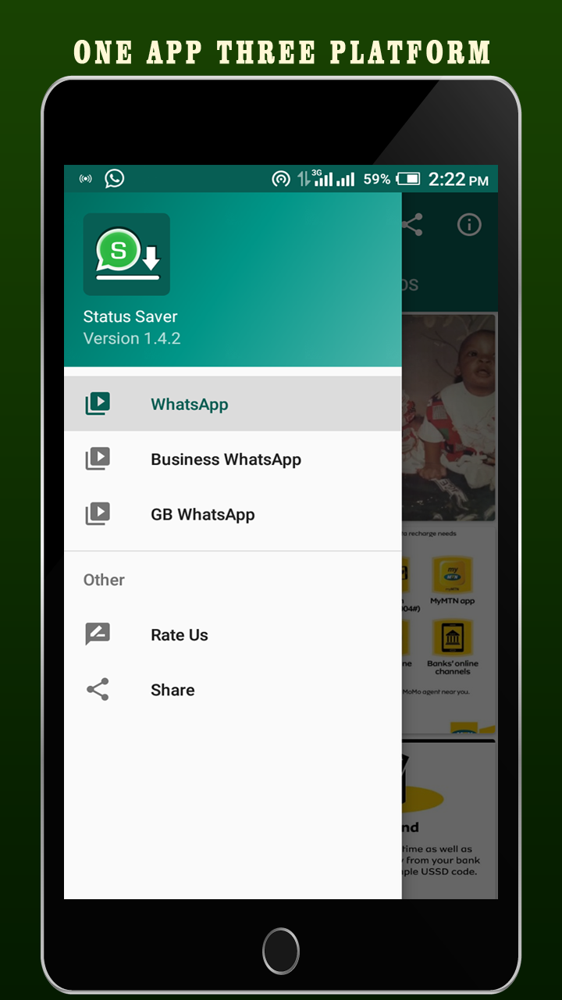
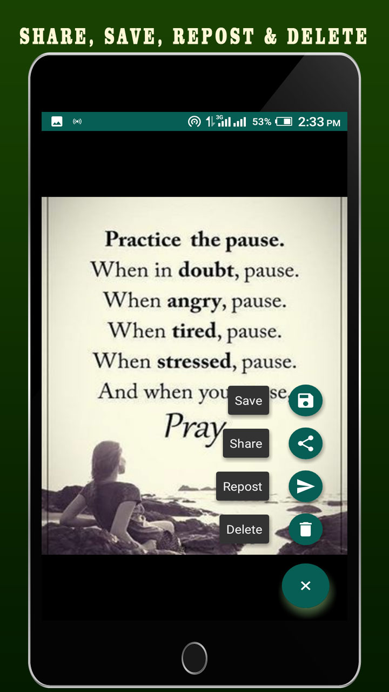
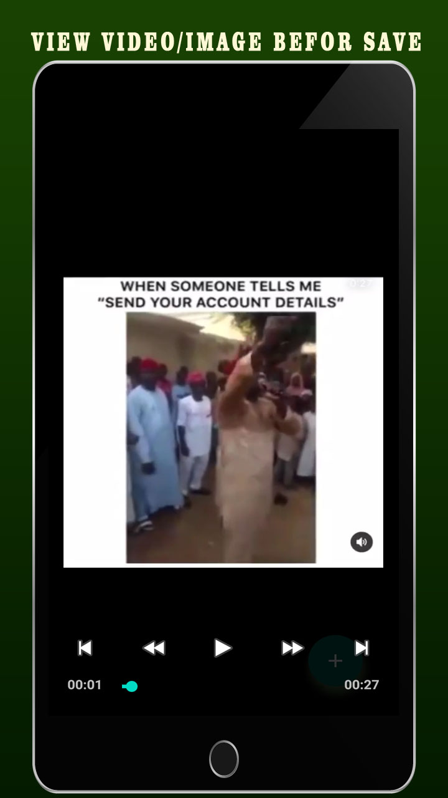
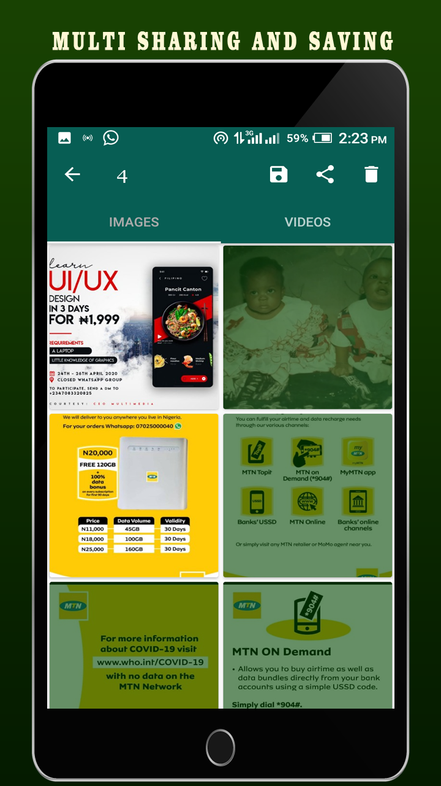

Status Saver
=====================

An all-in app for saving WhatsApp status

Features
========
* Save Image and Video for WhatsApp, Business WhatsApp and GB WhatsApp
  
  

* Share and re-post for images and videos.

  

* Delete any unwanted images and videos.

* Inbuilt Video Player.

  

* Multi-select images and videos to save, share or delete.

  

Caveats
=======
This App as of Version 1.4.2 works only on minSDk=>14 and minSDK<=29.

Credits
=======
This app employed external plugins like TouchImageView by [Mike Ortiz](http://github.com/MikeOrtiz) and Floating Action Button by [Jerzy Chałupski](http://github.com/chalup).

Disclaimer
==========
This software is not affliliated with, sponsored or endorsed by WhatsApp Inc.

License
=======

    Copyright (C) 2020 Chibundo Ilonze

    Licensed under the Apache License, Version 2.0 (the "License");
    you may not use this file except in compliance with the License.
    You may obtain a copy of the License at

         http://www.apache.org/licenses/LICENSE-2.0

    Unless required by applicable law or agreed to in writing, software
    distributed under the License is distributed on an "AS IS" BASIS,
    WITHOUT WARRANTIES OR CONDITIONS OF ANY KIND, either express or implied.
    See the License for the specific language governing permissions and
    limitations under the License.
